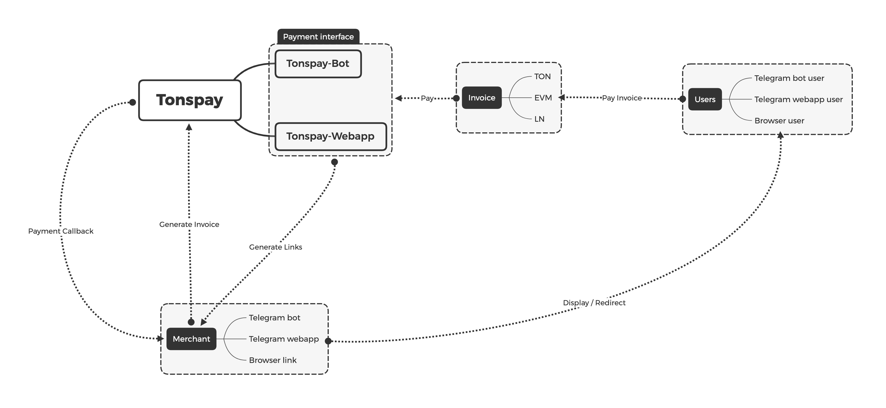

# 😇 Welcome

### What is Tonspay

Tonspay is a crypto payment solution base on **Telegram-bot & webapp** , support annoymouse payment **without KYC**.

Tonspay supporty for multichains payment , including : **TON** | **SOLANA** | **ARBITRUM** | **TRON** and **Binance-pay** . It provide a fully document restful-api and callback system for any merchant to onboard easily . The merchant of Tonspay can manage it's invoices by using **Tonspay-bot** | **Restful-api** | **Tonspay-dashboard** .&#x20;

Tonspay also working on low-code onboarding , Which should help those un-dev merchant to build it's own telegram-bot online shop using Tonspay as crypto payment solution.

### Functions of Tonspay

Currently , Tonspay support **3 major functions**&#x20;

*   **Invoice payments :**

    Invoice payments including : **merchant generate invoice** , **user pay invoice** , w**ebhook callback merchant .**&#x20;

    Tonspay invoice system provide fully document restful-api and open source demo for any merchant/developer to onboard . Also , Tonspay invoice payment support deeplink call , make user able to pay invoice with **both browser and mobil**e in native telegram payment experience .&#x20;
*   **Cashgift and group collection**

    Cashgift and group collection including : **user cash gift , group cash gift , group collection/invoice .**

    **Cashgift** allows user to send crypto currency annoymouse to anyone onchain . It will able to make Tonspay have more fission properties .  **Group cashgift** can help those telegram channel master/holder to make it's channel works better by share some cashgift to the member of channel in crypto .&#x20;

    **Group collections** are a simple way to help user in channel to host a payment request to others member . It is similar to group collection in Wechat-pay , allows user to generate invoice to members in channel , and will be tell when the invoices been paid .
*   **Multichains wallet managements for send/revice .**

    Wallet managements including : s**end crypto to friend without address , recive crypto without address , manage ultichains wallet** .

    Tonspay provide **multichains wallets management** , allows user to connect and sign it's crypto wallet . It will be able to makes a mapping of crypto currency wallet address and the telegram user id by Tonspay, which will help user to transfer crypto to friends by telegram id .

    Also , wallet amangement allows user to manage it's **balance** cross chains . No need to open multi wallet apps to check it's balance anymore . It makes Tonspay to be the decentralized wallet portals in telegram webapps.

### Why Tonspay&#x20;

Telegram-bot & Telegram-webapp needs a stable and easy use invoice-base cypto payment system . Anyone can use Tonspay to generate a invoice for crypto payment , and the fund will directly send to merchant's crypto account . No need any KYC .

*   **Native telegram payment user experience**&#x20;

    By using Tonspay , merchant can generate crypto invoice for users to pay in native telegram payment user experience . With the support of deeplink call , user can pay the invoice with mobile wallet easily .


Pay invoice using Solana



Pay invoice using TON


*   **Fast callback response**&#x20;

    Tonspay run public monitor around different contries . Able to listen onchain faster and translate onchain message into restful request webhook to merchant ontime .
*   **Fully document interface & SDK**&#x20;

    Docs are quit important for merchant onboard . So Tonspay provide details documents about the api interface . Also , provide different SDK for merchant & telegram-bot developer .&#x20;

### How Tonspay work

<figure><figcaption>
How Tonspay work
</figcaption></figure>

### Tonspay open source ?&#x20;

#### Currently tonspay are opensource parts :&#x20;

* [Tonspay-onchain-monitor](https://github.com/Tonspay/Tonspay-monitor)
* [Tonspay-evm-chain-payment-contract](https://github.com/Tonspay/Tonspay-evm-router-contract)
* [Tonspay-demo-merchant-bot](https://github.com/Tonspay/Tonspay-demo-steam-mystery-box-bot)
* [Tonspay-main-websit](https://github.com/Tonspay/Tonspay-websit)

#### As for the paymenst service-backend is not opensource yet.But it will publish it's framwork :

* #### Tonspay Server
  * Restful Interface
    * New payment method
    * New Invoice
    * Invoice Status
    * Invoice Callback
  * Web Interface
    * Account managment
    * Account payment method
      * Ln
      * Evm
        * ARB
        * Base
        * Polygon
      * Ton
      * Sol
      * Tron
* #### Tonspay Bot
  * Account management
  * Account payment method
  * Bot payment management
  * Invoice management
    * Invoice generate
    * Invoice status check
    * Invoice callback to bot
  * Payment action
    * Payment action
    * Payment callback
* Tonspay webapp
  * User wallet management  & connection
  * User invoices & actives managment
  * Payment actions
    * Pay invoices
    * Cancel invoices
  * Cash gift actions
    * Gnerate a new cash gift
    * Deposit money into it&#x20;
