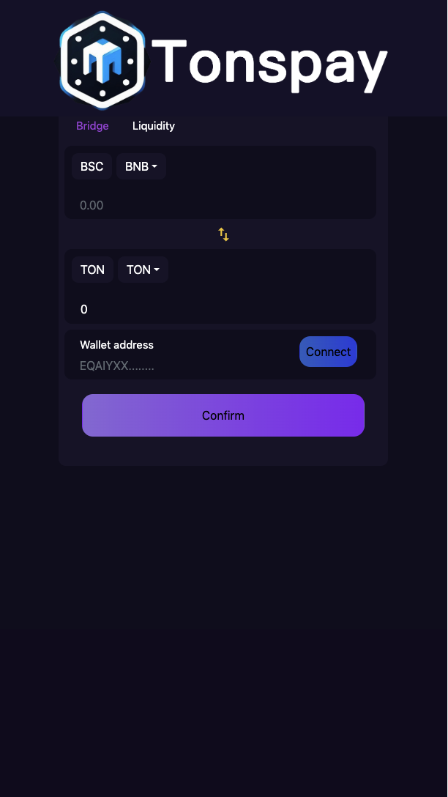
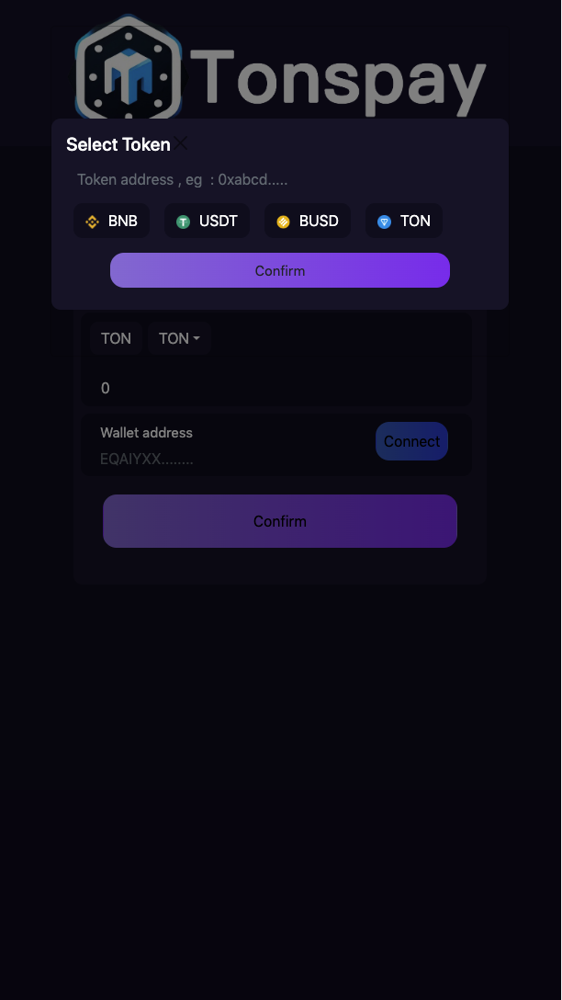
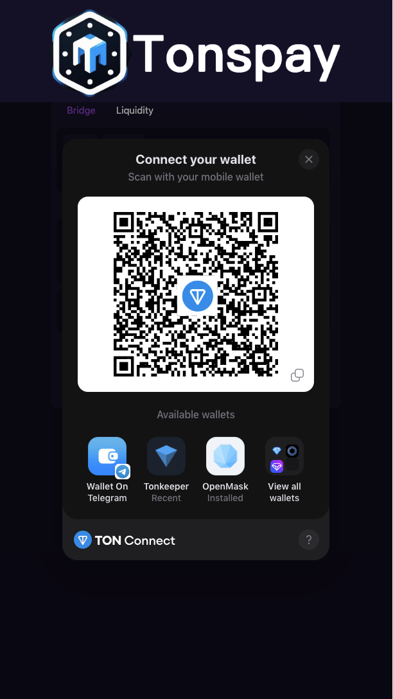
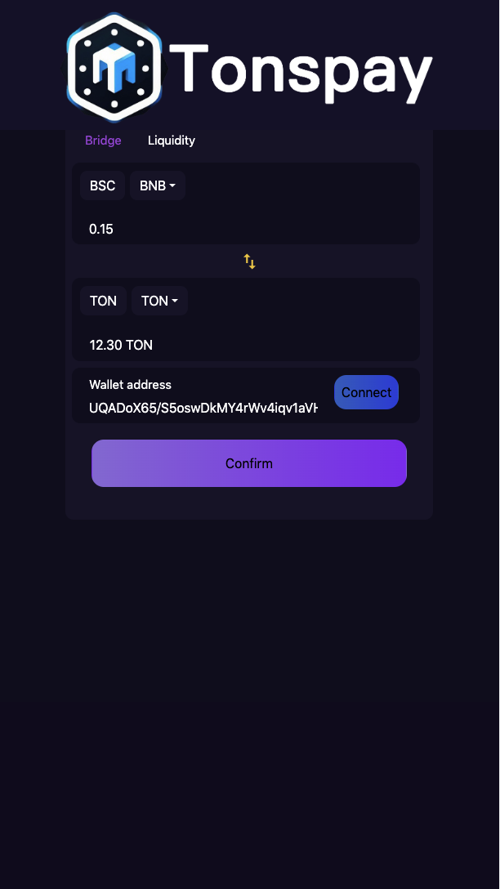
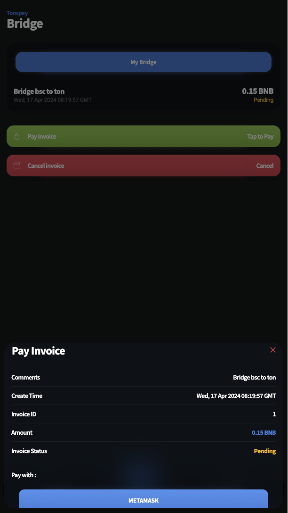

# How to use Tonsbridge

You can visit Tonsbridge via [Bot](https://t.me/tonsbridge\_bot) or [Websit](https://bridge.tonspay.top/)  .

<figure><figcaption>
Main visit . 
</figcaption></figure>

Select the chain / token and input the amount you wants to swap

<figure><figcaption></figcaption></figure>

<figure><figcaption></figcaption></figure>

Confirm the bridge setting .

<figure><figcaption></figcaption></figure>

Genegrate the bridge invioce&#x20;

<figure><figcaption></figcaption></figure>

Finally , pay the invoice to bridge .

<figure><figcaption></figcaption></figure>
